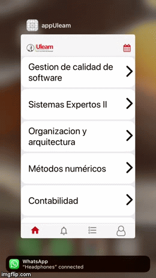
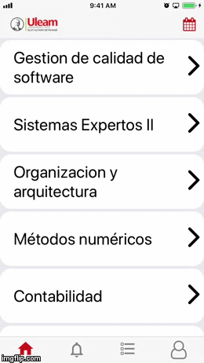
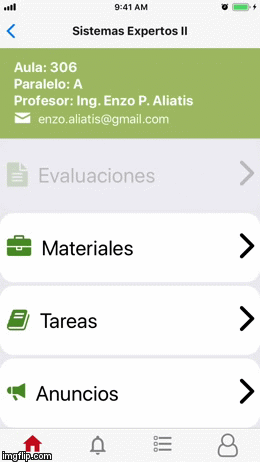
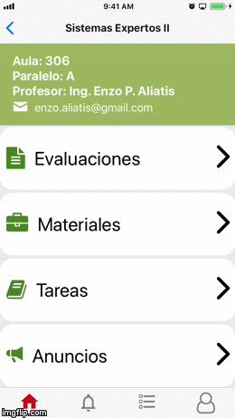

# Install
## Requirements
* node last version
* npm
* react-native [install guide](https://facebook.github.io/react-native/docs/getting-started)
* Android Studio | Xcode 

``` shell
$ npm install
```

## Run 
### dev mode
``` shell
$ react-native run-ios
$ react-native run-android
```
# Demo

## Login - Logout


## Persisted session


## Check schedule



## View subject information and send a direct email to the teacher.
* classroom 
* parallel
* teacher name
* teacher email 


## Check updated grades
* red background = reprobate
* green background = approved




## Download PDF Homeworks
* start date
* end date
* homework status


## Check ads and faults



## Check grades and charts


## Deep links to:
* email
* phone
* facebool
* twitter
* google maps
* web pages
* youtube


### For more download and install